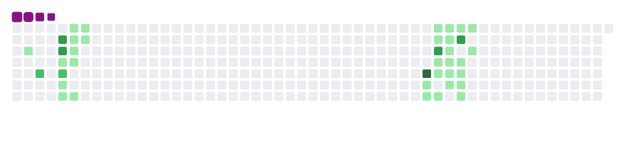

  

<h1 align="center">
  
</h1>

  
<!--   
   -->

  
  
  
  

<!-- Dynamic Stats Section -->

  
  

<!-- Dynamic Activity Graph -->

  

<!-- Dynamic Top Languages -->

  

<!-- Dynamic Profile Summary -->

  
  
  

    <h3>💫 Professional Overview</h3>
    <ul style="list-style: none; padding: 0;">
      <li>🎯 Enterprise Solution Architect specializing in scalable applications</li>
      <li>💡 Expert in MERN-stack development and system design</li>
      <li>🔧 Tech Stack: C++, Python, React, Node.js, Express, MySQL, MongoDB, AI</li>
      <li>📈 Proven track record of delivering high-impact solutions</li>
      <li>🌐 Focus on performance optimization and best practices</li>
      <li>📊 View my <a href="https://drive.google.com/file/d/1jY8dZler0K277uzZMOvdD66ucM95JpOh/view?usp=drive_link" target="_blank" style="color: #4F46E5; text-decoration: none; font-weight: 600;">Resume</a></li>
      <li>🔄 Committed to continuous learning and innovation</li>
    </ul>
  

<!-- Dynamic Tech Stack Section -->

  <h3 style="margin-bottom: 30px; background: linear-gradient(to right, #4F46E5, #9333EA); -webkit-background-clip: text; -webkit-text-fill-color: transparent; font-size: 26px; font-weight: 700; text-align: left;">
    🚀 Tech Stack
  </h3>
  

    
    
    
    
    
    
    
    
    
    
    
    
    
    
    
    
    
    
    
    
    
    
    
    
    
    
    
    
    
    
    
    
    
    
    
    
    
    
    
    
    
  

  

<!-- Dynamic Social Links -->

  <h2>🤝 Professional Network</h2>
  
  
  

<!-- GitHub Snake Animation -->

  

